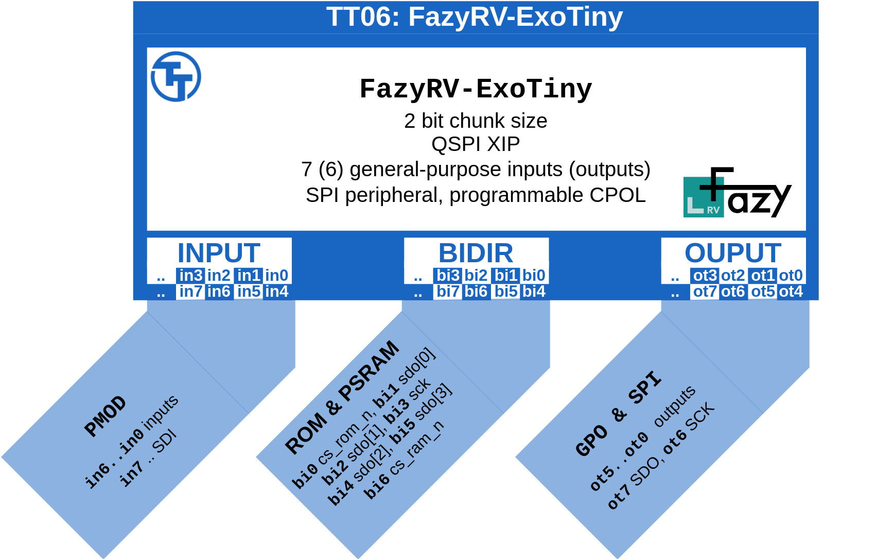

<!---

This file is used to generate your project datasheet. Please fill in the information below and delete any unused
sections.

You can also include images in this folder and reference them in the markdown. Each image must be less than
512 kb in size, and the combined size of all images must be less than 1 MB.
-->

## How it works

This TinyTapeout implements a System-on-Chip (SoC) design based on the FazyRV RISC-V core. Documentation on the SoC can be found in [github.com/meiniKi/FazyRV-ExoTiny](https://github.com/meiniKi/FazyRV-ExoTiny). For details on the FazyRV core, please refer to [github.com/meiniKi/FazyRV](https://github.com/meiniKi/FazyRV).

### Features
* Instantiates FazyRV with a chunk size of 2 bits.
* Uses external instruction memory (QSPI ROM) and external data memory (QSPI RAM).
* Provides 6 memory-mapped general-purpose outputs and  7 inputs.
* Provides an SPI peripheral with programmable CPOL and a buffer of up to 4 bytes.

### Pinout Overview

The overview shows the pinout for the TinyTapeout Demo PCB. A detailed description of the pins is given below.

### Block Diagram

The block diagram outlines the on-chip peripherals and related addresses.

## How to test

Once the design is enabled and released from reset, it first enables Quad Mode in the RAM. The Wishbone accesses are converted into QSPI transfers to exchange data. The first read from ROM (boot address: `0x00000000`) enabled Continuous Mode to reduce the latency. To get started, you can flash the demo firmware in `FazyRV-ExoTiny/demo`. See the repo for more information.

**Important:** `rst_n` is not synchronized. Make sure it is released sufficient hold time after the rising clock edge and sufficient setup time before the falling edge. Do not release reset while `clk` is low. The design appears to be on the edge of implementability. An additional dff breaks convergence.

## External hardware

* QSPI ROM: W25Q128JV or compatible
* QSPI RAM: APS6404L-3SQR or compatible

The design uses external ROM (Flash) and external RAM. All bus accesses in these regions are converted to QSPI transfers to read data from the ROM or to read/write data from/to the RAM, respectively. Alternatively, you can synthesize a model in an FPGA and attach it to the BIDIR PMOD header.
